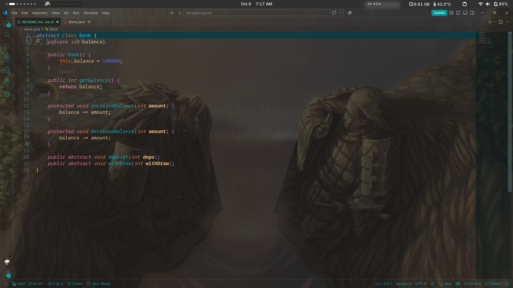
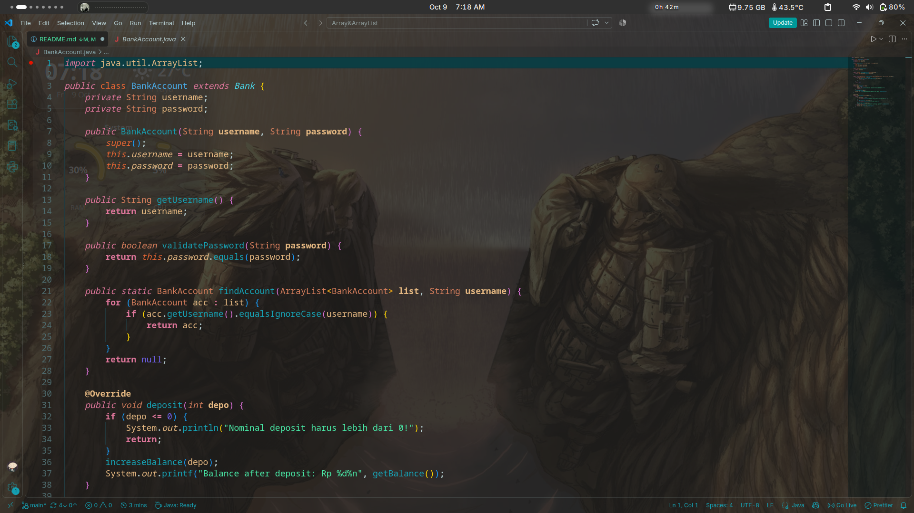
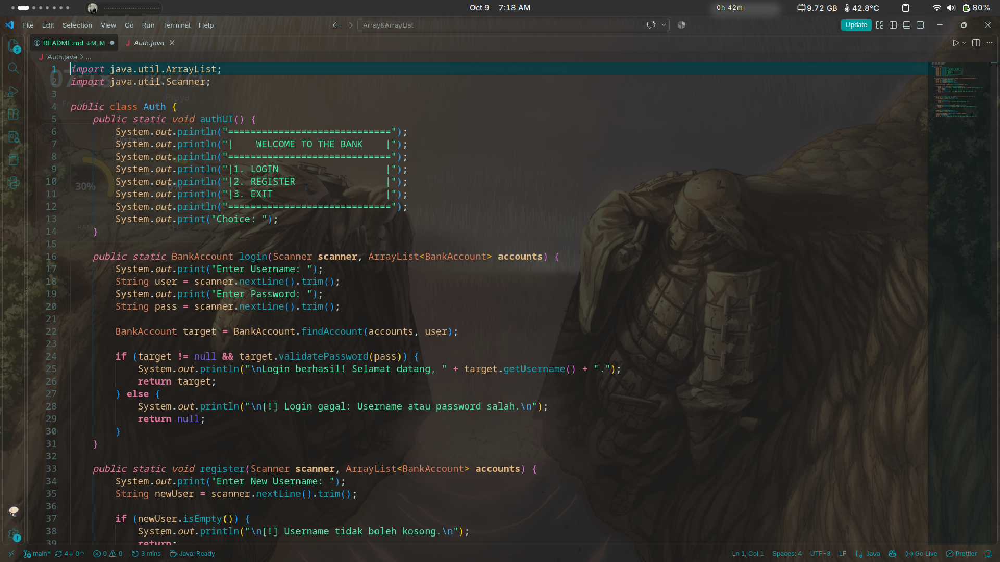
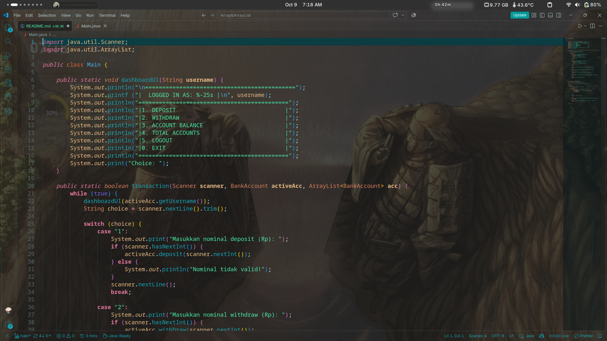
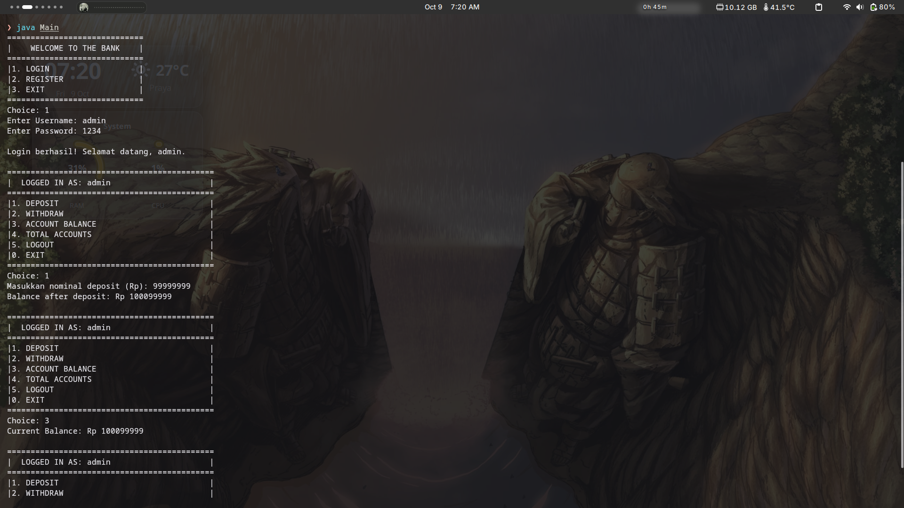

# Bank System (Array & ArrayList)

A small console application written in Java that simulates a basic banking service. Users can register an account, log in, deposit money, withdraw money, check their balance, and see how many accounts are registered. It was built as an assignment for the Object-Oriented Programming course, focusing on **ArrayList** for storing objects, together with **inheritance** and **abstraction**.

All accounts live in memory inside an `ArrayList<BankAccount>`, so the data is lost when the program exits. The program starts with one default account (`admin` / `1234`) so it can be tried right away.

## Project Structure

```
.
├── Bank.java           // abstract base class (balance logic)
├── BankAccount.java    // concrete account, extends Bank
├── Auth.java           // login, register, and welcome menu
└── Main.java           // dashboard menu and program entry point
```

## Class Hierarchy

```
Bank (abstract)
└── BankAccount
```

`BankAccount` inherits from `Bank`. `Auth` and `Main` are not part of the hierarchy. They only use `BankAccount` objects and handle the user interface.

## How to Compile and Run

Make sure a JDK is installed, then run these from the project folder:

```bash
javac *.java
java Main
```

## Code Explanation

### `Bank` (abstract base class)

<p align="center">
  
  <br>
  <em>Bank.java</em>
</p>

`Bank` holds the part that every kind of bank account shares: the balance. It is declared `abstract`, so it cannot be instantiated directly.

- **Field:** `balance`, an `int`, declared `private`. Subclasses cannot touch it directly.
- **Constructor:** sets the starting balance to `100000` (Rp 100.000), so every new account begins with that amount.
- **`getBalance()`:** a public getter that returns the current balance.
- **`increaseBalance(int amount)` and `decreaseBalance(int amount)`:** `protected` methods that add to or subtract from the balance. Because they are `protected`, only subclasses (and classes in the same package) can change the balance. The outside world has to go through the public transaction methods instead.
- **`deposit(int depo)` and `withDraw(int withDraw)`:** abstract methods with no body. Any concrete account type must define how deposits and withdrawals behave, including its own validation rules.

### `BankAccount` (concrete account)

<p align="center">
  
  <br>
  <em>BankAccount.java</em>
</p>

`BankAccount` extends `Bank` and adds the identity of the account owner.

- **Fields:** `username` and `password`, both `private`.
- **Constructor:** calls `super()` so `Bank` sets up the starting balance, then stores the username and password.
- **`getUsername()`:** returns the username. There is deliberately no `getPassword()`.
- **`validatePassword(String password)`:** compares the given password with the stored one and returns a `boolean`. This lets other classes check a login without ever reading the password.
- **`findAccount(ArrayList<BankAccount>, String)`:** a `static` method that loops through the list and returns the account whose username matches (ignoring upper and lower case), or `null` if none matches. Both login and registration use it.
- **`deposit(int depo)`:** implements the abstract method. It rejects values of 0 or less, otherwise calls `increaseBalance()` and prints the new balance.
- **`withDraw(int withDraw)`:** implements the abstract method. It throws an `Exception` when the amount is 0 or less, or when the balance is not enough. The `catch` block prints the error message. When both checks pass, it calls `decreaseBalance()` and prints the new balance.

### `Auth` (authentication helpers)

<p align="center">
  
  <br>
  <em>Auth.java</em>
</p>

`Auth` only contains `static` methods, so it is never instantiated. It handles everything that happens before a user is logged in.

- **`authUI()`:** prints the welcome menu (login, register, exit).
- **`login(Scanner, ArrayList<BankAccount>)`:** asks for a username and password, looks up the account with `findAccount()`, and checks the password with `validatePassword()`. It returns the matching `BankAccount` on success or `null` on failure.
- **`register(Scanner, ArrayList<BankAccount>)`:** asks for a new username and rejects it if it is empty or already taken. If it is acceptable, it asks for a password, creates a new `BankAccount`, and adds it to the list.

Input from the user is passed through `trim()` so accidental leading or trailing spaces do not break a login.

### `Main` (dashboard and program flow)

<p align="center">
  
  <br>
  <em>Main.java</em>
</p>

`Main` ties everything together.

- **`dashboardUI(String)`:** prints the menu shown after logging in, including the current username. `printf` with `%-25s` keeps the box border aligned.
- **`transaction(Scanner, BankAccount, ArrayList<BankAccount>)`:** runs the logged-in session in a loop. It reads the choice and uses a `switch`:
    - **Option 1, Deposit:** reads an integer and calls `deposit()`.
    - **Option 2, Withdraw:** reads an integer and calls `withDraw()`.
    - **Option 3, Account balance:** prints `getBalance()`.
    - **Option 4, Total accounts:** prints `acc.size()`, the number of objects in the `ArrayList`.
    - **Option 5, Logout:** returns `true`, meaning the program should go back to the welcome menu.
    - **Option 0, Exit:** returns `false`, meaning the whole program should stop.
- **Number input:** the program checks `hasNextInt()` before reading, so typing letters prints an error message instead of crashing. The extra `nextLine()` afterwards removes the leftover newline so the next menu read is not skipped.
- **`main()`:** creates the `Scanner` and the `ArrayList<BankAccount>`, adds the default `admin` account, and enters the main loop labeled `appLoop`. Option 1 logs in and, on success, starts `transaction()`. If `transaction()` returns `false`, the labeled `break appLoop` exits the outer loop directly from inside the `switch`. Option 2 registers a new account and option 3 exits.

## Concepts Demonstrated

### ArrayList

- All accounts are stored in one `ArrayList<BankAccount>`. New accounts are added with `add()`, searched with a loop in `findAccount()`, and counted with `size()`.
- The list is created once in `main()` and passed to the methods that need it, so every part of the program works on the same data.

### Inheritance

- `BankAccount` reuses the balance field and the balance methods from `Bank` and calls `super()` in its constructor to let the parent initialize the starting balance.

### Abstraction

- `Bank` declares `deposit()` and `withDraw()` without bodies. This forces every concrete account type to define its own transaction behavior, while the shared balance logic stays in one place.

### Polymorphism (method overriding)

- `BankAccount` provides its own implementations of `deposit()` and `withDraw()` with `@Override`. The abstract methods in `Bank` define the signature, and the subclass decides the behavior. Any new account type added later could override them differently, and code written against `Bank` would work with it unchanged.

### Encapsulation

- `balance`, `username`, and `password` are all `private`. The balance can only change through the `protected` helper methods, which are reached only after the validation in `deposit()` and `withDraw()`. The password is never exposed, and can only be checked through `validatePassword()`.

### Exception Handling

- `withDraw()` uses `throw` and `try/catch` to report invalid amounts and insufficient balance with a clear message.

## Sample Run

```
=============================
|    WELCOME TO THE BANK    |
=============================
|1. LOGIN                   |
|2. REGISTER                |
|3. EXIT                    |
=============================
Choice: 1
Enter Username: admin
Enter Password: 1234

Login berhasil! Selamat datang, admin.

(dashboard menu)
Choice: 1
Masukkan nominal deposit (Rp): 50000
Balance after deposit: Rp 150000

(dashboard menu)
Choice: 2
Masukkan nominal withdraw (Rp): 200000
Saldo tidak cukup!

(dashboard menu)
Choice: 3
Current Balance: Rp 150000
```

### Program Output

<p align="center">
  
  <br>
  <em>Program output</em>
</p>
