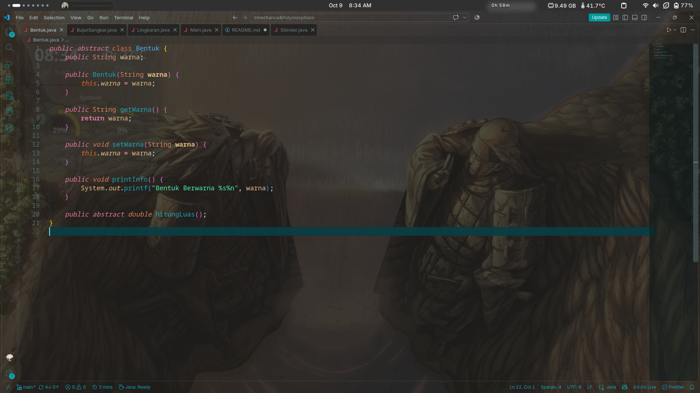
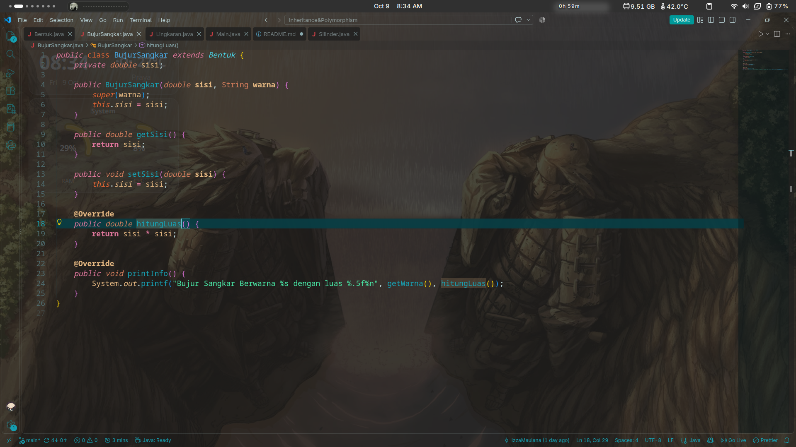
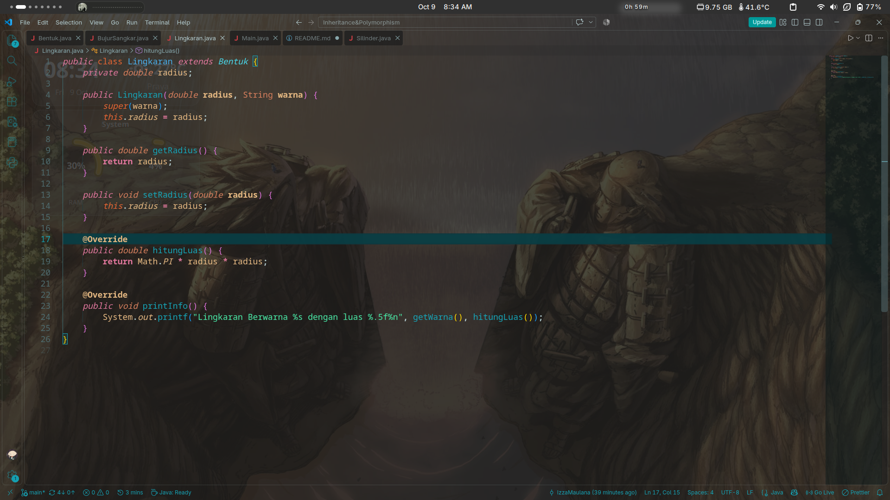
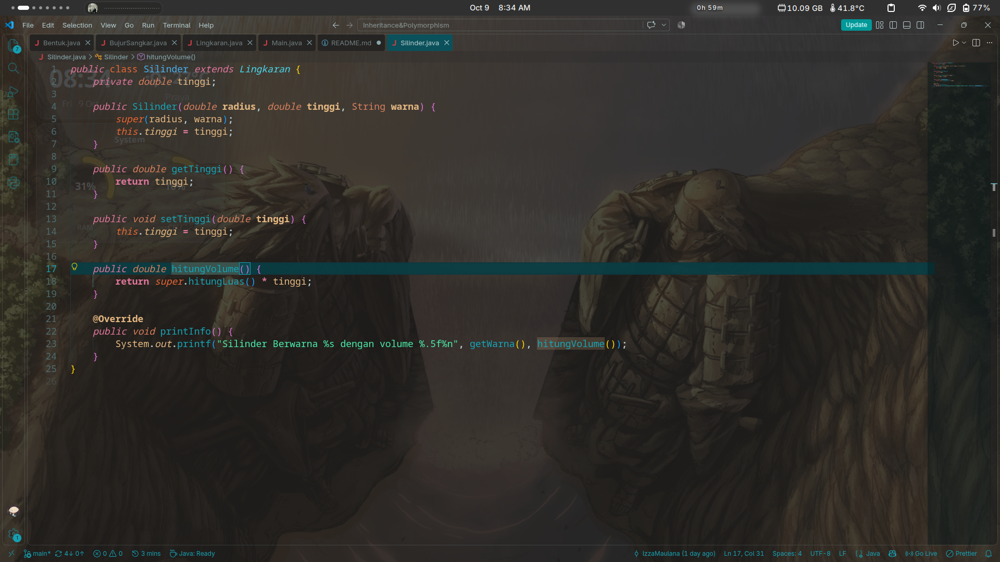
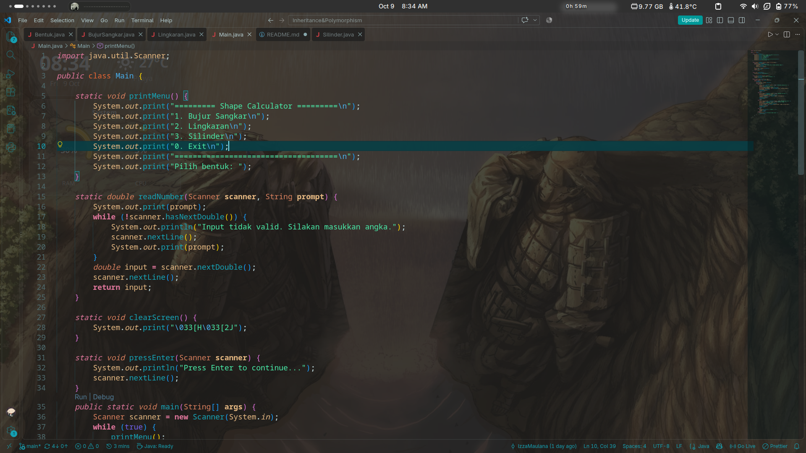
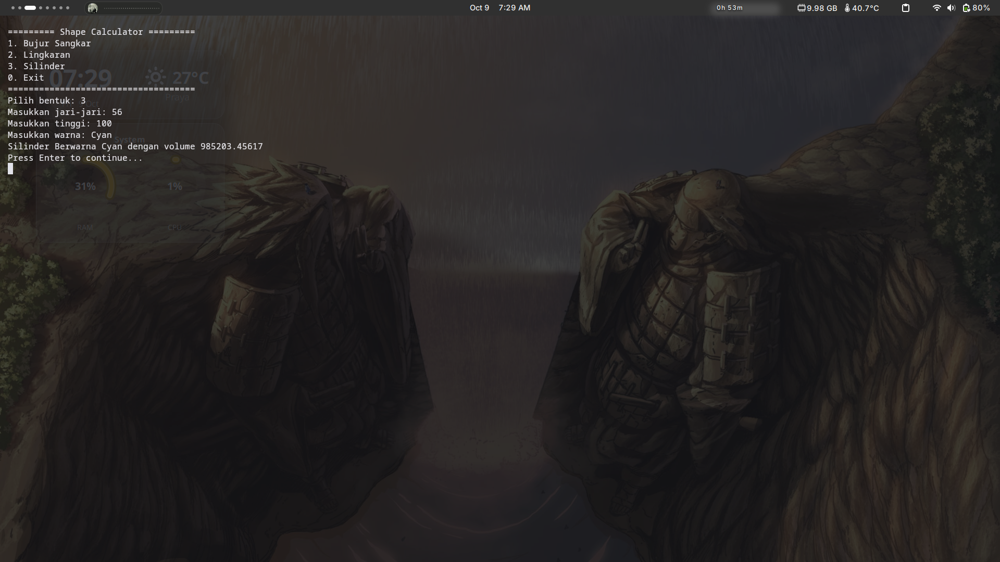

# Shape Calculator (Inheritance & Polymorphism)

A small console application written in Java that calculates the area of a square and a circle, and the volume of a cylinder. It was built as an assignment for the Object-Oriented Programming course, focusing on two core concepts: **inheritance** and **polymorphism**.

The user picks a shape from a text menu, enters the dimensions and a color, and the program prints a one-line summary of that shape.

## Project Structure

```
.
├── Bentuk.java         // abstract base class
├── BujurSangkar.java   // square, extends Bentukimages/BujurSangkar.png
├── Lingkaran.java      // circle, extends Bentuk
├── Silinder.java       // cylinder, extends Lingkaran
└── Main.java           // menu and program entry point
```

## Class Hierarchy

```
Bentuk (abstract)
├── BujurSangkar
└── Lingkaran
    └── Silinder
```

There are two levels of inheritance here. `BujurSangkar` and `Lingkaran` both inherit directly from `Bentuk`, while `Silinder` inherits from `Lingkaran`, which means it indirectly inherits from `Bentuk` as well.

## How to Compile and Run

Make sure a JDK is installed, then run these from the project folder:

```bash
javac *.java
java Main
```

The screen clearing uses an ANSI escape sequence, so it works best in a terminal that supports ANSI codes (most Linux and macOS terminals, and Windows Terminal).

## Code Explanation

### `Bentuk` (abstract base class)

<p align="center">
  
  <br>
  <em>Bentuk.java</em>
</p>

`Bentuk` ("shape") is the root of the hierarchy. It is declared `abstract`, so it cannot be instantiated directly. Its job is to hold what every shape has in common and to force subclasses to provide what differs.

- **Field:** `warna` (color), stored as a `String`.
- **Constructor:** `Bentuk(String warna)` sets the color. Subclasses call it through `super(warna)`.
- **Getter and setter:** `getWarna()` and `setWarna()` give access to the color.
- **`printInfo()`:** a regular method with a default implementation that prints `Bentuk Berwarna <color>`. Subclasses are expected to override it with something more specific.
- **`hitungLuas()`:** an abstract method that returns a `double`. It has no body here. Every concrete subclass must implement it, otherwise it will not compile. This is what makes `Bentuk` a contract: any shape must know how to calculate its own area.

### `BujurSangkar` (square)

<p align="center">
  
  <br>
  <em>BujurSangkar.java</em>
</p>

`BujurSangkar` extends `Bentuk` and adds one field of its own, `sisi` (side length).

- The constructor takes the side and the color. It passes the color up with `super(warna)` and stores the side itself.
- `hitungLuas()` is the implementation of the abstract method and returns `sisi * sisi`.
- `printInfo()` overrides the parent version and prints the color together with the area, formatted to five decimal places, for example `Bujur Sangkar Berwarna Merah dengan luas 25.00000`.
- It reads the color through `getWarna()` and the area through `hitungLuas()`, so it does not repeat any logic.

### `Lingkaran` (circle)

<p align="center">
  
  <br>
  <em>Lingkaran.java</em>
</p>

`Lingkaran` extends `Bentuk` and adds `radius`.

- The constructor works the same way as in `BujurSangkar`: send the color to the parent, keep the radius locally.
- `hitungLuas()` returns `Math.PI * radius * radius`.
- `printInfo()` is overridden to print the circle's color and area.

### `Silinder` (cylinder)

<p align="center">
  
  <br>
  <em>Silinder.java</em>
</p>

`Silinder` extends `Lingkaran`, so it already has a radius, a color, and the circle area calculation. It only needs to add the height.

- **Field:** `tinggi` (height).
- **Constructor:** `Silinder(double radius, double tinggi, String warna)` calls `super(radius, warna)` to let `Lingkaran` handle the radius and color, then stores the height.
- **`hitungVolume()`:** returns `super.hitungLuas() * tinggi`. The cylinder volume is the base area (a circle) multiplied by the height, so the code reuses the area method from the parent class through `super` instead of rewriting the formula.
- **`printInfo()`:** overridden to print the volume instead of the area, since volume is the meaningful value for a cylinder.

Because `Silinder` is a `Lingkaran`, and a `Lingkaran` is a `Bentuk`, a `Silinder` object can be used anywhere a `Lingkaran` or `Bentuk` is expected.

### `Main` (menu and program flow)

<p align="center">
  
  <br>
  <em>Main.java</em>
</p>

`Main` handles all user interaction. A few small helper methods keep `main()` readable:

- `printMenu()` prints the menu with options 1 (square), 2 (circle), 3 (cylinder), and 0 (exit).
- `readNumber(Scanner, String)` prompts for a number and keeps asking until the input is a valid `double`. It uses `hasNextDouble()` to check the input, discards bad input with `nextLine()`, and consumes the leftover newline after a successful read so the next `nextLine()` call is not skipped.
- `clearScreen()` prints the ANSI sequence `\033[H\033[2J` to clear the terminal.
- `pressEnter(Scanner)` pauses the program until the user presses Enter, so the result stays on screen long enough to read.

The `main()` method runs an infinite `while (true)` loop. Each round it shows the menu, reads the choice as a string, and uses a `switch` to decide what to do:

1. **Case `"1"`:** reads the side and color, creates a `BujurSangkar`, and calls `printInfo()`.
2. **Case `"2"`:** reads the radius and color, creates a `Lingkaran`, and calls `printInfo()`.
3. **Case `"3"`:** reads the radius, height, and color, creates a `Silinder`, and calls `printInfo()`.
4. **Case `"0"`:** prints a goodbye message, closes the `Scanner`, and ends the program with `System.exit(0)`.
5. **Default:** prints an error message for an invalid choice.

## Concepts Demonstrated

### Inheritance

- `BujurSangkar` and `Lingkaran` reuse the `warna` field, its getter and setter, and the constructor chain from `Bentuk`.
- `Silinder` builds on `Lingkaran` and reuses its radius handling and area calculation instead of duplicating them.
- `super(...)` is used in constructors to pass data up the hierarchy, and `super.hitungLuas()` is used in `Silinder` to call the parent's method directly.

### Abstraction

- `Bentuk` is abstract and declares `hitungLuas()` without a body. This guarantees that every concrete shape defines its own area calculation, while leaving the details to each subclass.

### Polymorphism (method overriding)

- `printInfo()` is defined in `Bentuk` and overridden in `BujurSangkar`, `Lingkaran`, and `Silinder`. The same method name produces different output depending on the actual type of the object. Java picks the right version at runtime (dynamic method dispatch).
- `hitungLuas()` follows the same idea: one signature in `Bentuk`, a different implementation in each subclass.
- The `@Override` annotation is used on every overriding method so the compiler can catch mistakes such as a misspelled method name or a wrong signature.

### Encapsulation

- The shape-specific fields (`sisi`, `radius`, `tinggi`) are `private` and accessed only through getters and setters.

## Sample Run

```
========= Shape Calculator =========
1. Bujur Sangkar
2. Lingkaran
3. Silinder
0. Exit
====================================
Pilih bentuk: 3
Masukkan jari-jari: 7
Masukkan tinggi: 10
Masukkan warna: Biru
Silinder Berwarna Biru dengan volume 1539.38040
Press Enter to continue...
```

### Program Output

<p align="center">
  
  <br>
  <em>Program output</em>
</p>

## Design Notes

- `Silinder` extends `Lingkaran` so that the circle area logic can be reused for the cylinder base. This works well for the purpose of this assignment, but it is a modeling shortcut: a cylinder is not strictly "a kind of circle". A composition-based design (a cylinder that has a circle as its base) would be the more faithful model in a larger project.
- Inherited `hitungLuas()` in `Silinder` still returns the area of the circular base, not the cylinder's surface area. The volume is exposed separately through `hitungVolume()`.
- `printInfo()` formats numbers with `%.5f`, so every result shows five digits after the decimal point.